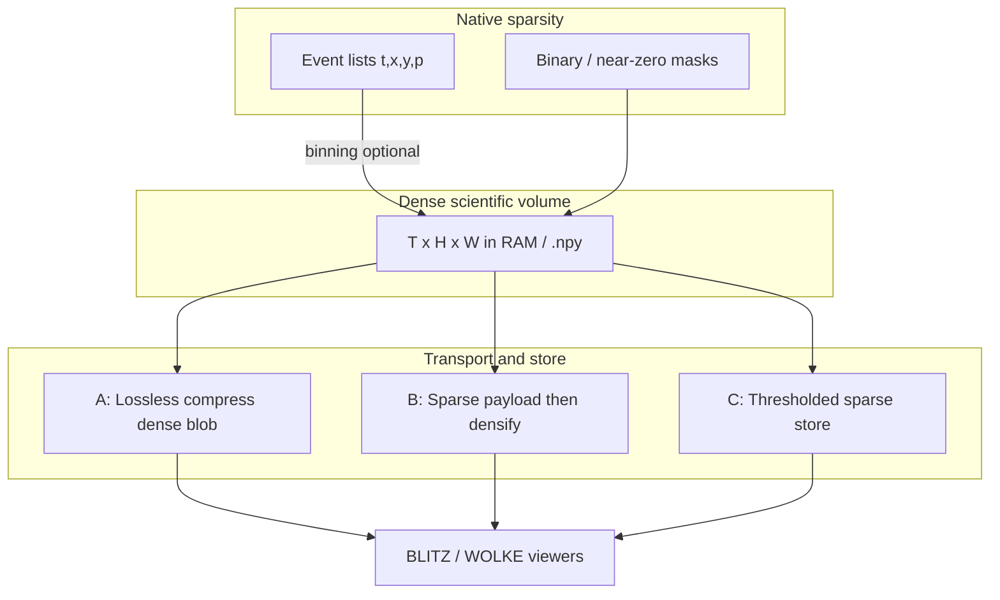

# Sparse & thinly populated matrices (WETTER-wide)

**Status:** backlog / architecture note — **not** a build for today.  
**Scope:** whole **WETTER** pipeline (DAMPF → KEIM → WOLKE → BLITZ), plus sidecars such as **EVT**.

Event-camera stacks made the issue obvious (mostly zeros, few spikes). The same
pattern is normal for much of our research imaging: plasma / diagnostics frames
with **background ≈ 0 (or noise floor)**, sparse signal, and long time axes
(`T` in the thousands–tens of thousands). Dense `(T, Y, X[, C])` then becomes
RAM- and I/O-heavy even when most voxels carry no information.

---

## Problem

| Factor | Effect |
|--------|--------|
| Large `T` | Volume ∝ `T × H × W` — tens of GB easy |
| Thin occupancy | Often ≫50% of samples are exact zero, noise, or below a useful threshold |
| Dense on disk / Network | WOLKE → BLITZ `.npy` and BLITZ in-RAM matrices pay full size |
| EVT special case | Native stream is already event-list sparse; binning re-densifies |

BLITZ already has **load-time levers** (8-bit, grayscale, subset/step, max RAM,
normalize options). Missing is a **framework-level story** for “treat below
threshold as absent” and for **compression / sparse transport** without
pretending every voxel must live as a dense float forever.

---

## Warning (signal loss)

Any hard threshold or sparse drop is **lossy** unless the floor is truly
non-informative for the science question.

> **Attention:** Thresholding or “store only non-zeros” can remove real weak
> signal and bias ROI statistics, means, and correlations. Always keep an
> explicit opt-in, log the threshold, and prefer reversible paths (compress
> dense losslessly, or keep a float sidecar) when quantification matters.

---

## Layers (think in this order)

### A — Cheap: compress dense (lossless)

gzip / lz4 / zstd on uint8 or float `.npy` (or HTTP `Content-Encoding`).

- **Work:** small (servers + downloaders).
- **Gain:** often large when occupancy is low (EVT uint8 stacks, dark frames).
- **Signal:** unchanged.
- **First candidate** for EVT Sidecar ↔ BLITZ and large WOLKE pushes.

### B — Medium: sparse on the wire, dense in the viewer

COO / CSR / “list of (t,y,x,value)” → densify once in BLITZ (or in a sidecar
before the existing WOLKE contract).

- **Work:** new payload + unpack; contract extension or sidecar-only format.
- **Gain:** transfer and temp files shrink; peak RAM still dense unless the
  viewer learns sparse ops.
- **Signal:** lossless if all non-zeros kept.

### C — Opt-in: threshold → “non-existent”

Define `v_abs < thr` (or relative to noise / percentile) as **absent**.

- Maps to BLITZ load philosophy (already think in thresholds / 8-bit / RAM caps).
- **Work:** policy UI + provenance (thr, units, who set it) + clear warning.
- **Gain:** extreme if ~50%+ of voxels drop — disk, Network, and optionally RAM
  if storage stays sparse.
- **Signal:** **lossy** — must be labelled and default off for quantitative work.

### D — Later: sparse-aware analysis (hard)

True win for `T ~ 10⁴` is not only smaller files but **algorithms that never
materialize full dense cubes** (ROI extract from COO, sparse reduce). That is a
larger BLITZ/`ImageData` redesign — out of scope until A–C prove value.

---

## Relation to tools

| Tool | Role in this topic |
|------|--------------------|
| **DAMPF** | Could record occupancy / dtype / suggested thr in DB metadata |
| **KEIM** | Stats on sparse vs dense; avoid forcing full materialization |
| **WOLKE** | Delivery contract: compressed or sparse payloads to viewers |
| **BLITZ** | Load dialogs, RAM caps; future unpack / thr; keep Flatpak free of EVT SDK |
| Event reader (`EVT/`) | Event-native sparse → optional dense bin; first place to try **A** |
| **FUNKE** (later) | Live / multi-format streamer into BLITZ — see [`funke.md`](funke.md) |

EVT is one **instance** of the general rule, not a one-off format problem.

---

## Practical backlog (no schedule)

1. Document this note (done) and link from tool READMEs / TODOs.
2. Prototype **A** on EVT → BLITZ HTTP (measure MB before/after on real RAW).
3. Inventory BLITZ load paths: where a documented **optional threshold** would
   plug in without surprising existing °C / float workflows.
4. Only if A is insufficient: sketch sparse `.npy`-adjacent or NPZ layout for
   WOLKE without breaking today’s `send_file_message` clients.
5. Defer sparse-native `ImageData` until there is a measured pain with
   `T ≥ 10k` after compression.

---

## Non-goals (for now)

- Embedding Metavision/MDK in BLITZ.
- Silent thresholding on radiometric / calibrated floats.
- Replacing dense analysis for users who need every background sample.
