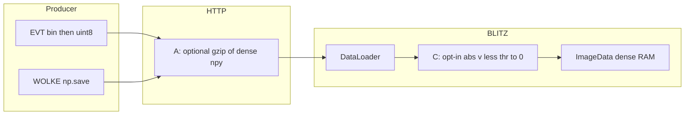
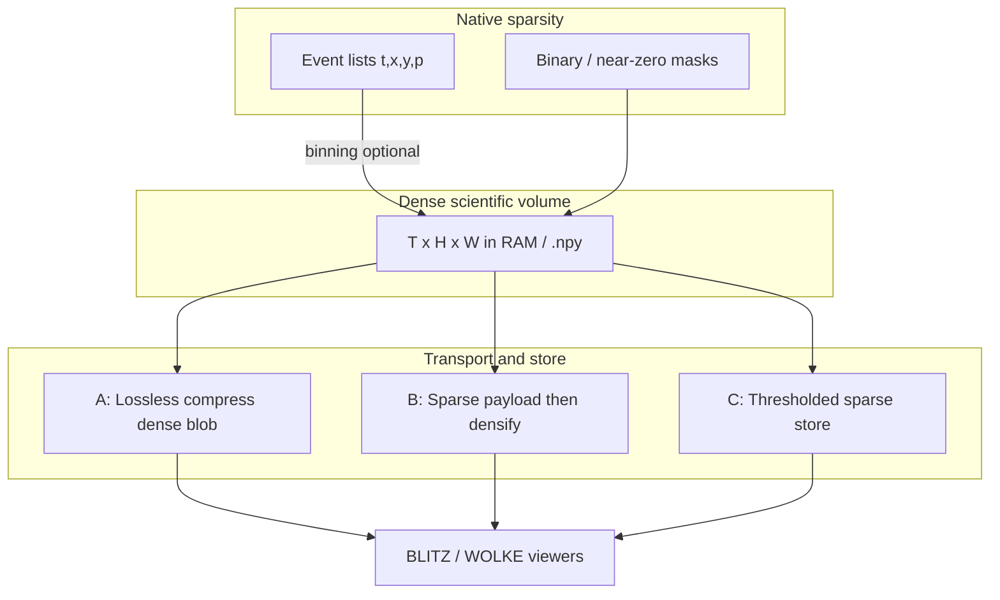

# Sparse & thinly populated matrices (WETTER-wide)

**Status:** epic in progress — **A** (optional HTTP gzip of dense `.npy`) and **C**
(opt-in `|v| < thr → 0` in the BLITZ loader) are implemented. Internally BLITZ
still holds a **dense** cube (`ImageData`); A and C are complementary, not
alternatives. **B** (COO on the wire) and **D** (sparse-native analysis) remain
deferred.

**Scope:** whole **WETTER** pipeline (DAMPF → KEIM → WOLKE → BLITZ), plus sidecars such as **EVT**.

Event-camera stacks made the issue obvious (mostly zeros, few spikes). The same
pattern is normal for much of our research imaging: plasma / diagnostics frames
with **background ≈ 0 (or noise floor)**, sparse signal, and long time axes
(`T` in the thousands–tens of thousands). Dense `(T, Y, X[, C])` then becomes
RAM- and I/O-heavy even when most voxels carry no information.

---

## How it is treated internally

BLITZ is a dense-matrix viewer after every load. Gzip on the HTTP body does not
change that; zeroing values below a threshold also does not shrink RAM (zeros
occupy the same `nbytes` as values).

- **A** — lossless encoding on the wire (`Content-Encoding: gzip` when the
  client sends `Accept-Encoding: gzip`). Peak RAM in BLITZ unchanged.
- **C** — File-tab opt-in `floor_abs` after `np.load`, before 8-bit/resize.
  Lossy. Default off. Network ingest (`WebDataLoader`) uses the same File-tab
  params. Does **not** run on WOLKE before send (no science UI there).
- EVT maps counts to uint8 (`stack_for_network`) before HTTP — **raw counts**
  by default (clip 255), optional log1p stretch.
  That is display quantization, not C. The resulting exact zeros gzip well.

---

## Problem

| Factor | Effect |
|--------|--------|
| Large `T` | Volume ∝ `T × H × W` — tens of GB easy |
| Thin occupancy | Often ≫50% of samples are exact zero, noise, or below a useful threshold |
| Dense on disk / Network | WOLKE → BLITZ `.npy` and BLITZ in-RAM matrices pay full size |
| EVT special case | Native stream is already event-list sparse; binning re-densifies |

BLITZ load-time levers: 8-bit, grayscale, subset/step, max RAM, normalize, and
opt-in **Floor |v|**. Transport: optional gzip of the dense `.npy` blob.

---

## Warning (signal loss)

Any hard threshold or sparse drop is **lossy** unless the floor is truly
non-informative for the science question.

> **Attention:** Thresholding or “store only non-zeros” can remove real weak
> signal and bias ROI statistics, means, and correlations. Always keep an
> explicit opt-in, log the threshold, and prefer reversible paths (compress
> dense losslessly, or keep a float sidecar) when quantification matters.

---

## Layers (think in this order)

### A — Cheap: compress dense (lossless)

gzip on uint8 or float `.npy` via HTTP `Content-Encoding`. **WOLKE** still
compresses when the client sends `Accept-Encoding: gzip`. **Event reader** does
**not**: gzip is opt-in (`?gzip=1`) because the usual path is localhost (zip then
unzip is wasted CPU). BLITZ also sends `Accept-Encoding: identity` for
loopback addresses. Clients without the gzip header always get raw `.npy`.

- **Work:** small (servers + downloaders).
- **Gain:** often large when occupancy is low (EVT uint8 stacks, dark frames).
- **Signal:** unchanged.

### B — Medium: sparse on the wire, dense in the viewer

COO / CSR / “list of (t,y,x,value)” → densify once in BLITZ (or in a sidecar
before the existing WOLKE contract).

- **Work:** new payload + unpack; contract extension or sidecar-only format.
- **Gain:** transfer and temp files shrink; peak RAM still dense unless the
  viewer learns sparse ops.
- **Signal:** lossless if all non-zeros kept.

### C — Opt-in: threshold → “non-existent”

Define `|v| < thr` as **absent** (stored as 0 in the dense cube). BLITZ File tab
**Floor |v|** + threshold spinbox; provenance in the load log.

- Maps to BLITZ load philosophy (already think in thresholds / 8-bit / RAM caps).
- **Work:** policy UI + provenance (thr, units) + warning tooltip.
- **Gain:** occupancy for later gzip/export; **not** RAM until option D.
- **Signal:** **lossy** — labelled, default off for quantitative work.

### D — Later: sparse-aware analysis (hard)

True win for `T ~ 10⁴` is not only smaller files but **algorithms that never
materialize full dense cubes** (ROI extract from COO, sparse reduce). That is a
larger BLITZ/`ImageData` redesign — out of scope until A–C prove value.

---

## Relation to tools

| Tool | Role in this topic |
|------|--------------------|
| **DAMPF** | Could record occupancy / dtype / suggested thr in DB metadata |
| **KEIM** | Stats on sparse vs dense; avoid forcing full materialization |
| **WOLKE** | Delivery contract: gzip `.npy` to viewers (`Content-Encoding`) |
| **BLITZ** | Load File-tab Floor \|v\|; RAM caps; keep Flatpak free of EVT SDK |
| Event reader (`EVT/`) | Event-native sparse → optional dense bin; gzip on HTTP |
| **FUNKE** (later) | Live / multi-format streamer into BLITZ — see [`funke.md`](funke.md) |

EVT is one **instance** of the general rule, not a one-off format problem.

---

## Practical backlog (no schedule)

1. Document this note (done) and link from tool READMEs / TODOs.
2. **A** on EVT → BLITZ HTTP (gzip) — implemented; measure MB on real RAW in use.
3. **C** optional threshold in BLITZ `DataLoader` / File tab — implemented.
4. Only if A is insufficient: sketch sparse `.npy`-adjacent or NPZ layout for
   WOLKE without breaking today’s `send_file_message` clients.
5. Defer sparse-native `ImageData` until there is a measured pain with
   `T ≥ 10k` after compression.

---

## Non-goals (for now)

- Embedding Metavision/MDK in BLITZ.
- Silent thresholding on radiometric / calibrated floats.
- Replacing dense analysis for users who need every background sample.
- Thresholding on WOLKE before send.
- COO payloads (B) or sparse `ImageData` (D).
