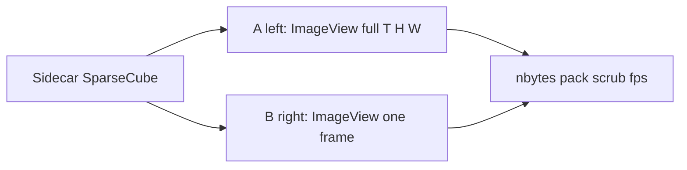

# Sparse & thinly populated matrices across WETTER

**Status:** **A** (gzip) shipped. **C** (Floor |v|) and **D** (sparse `ImageData`) **dropped** (2026-08-18). Contrast stays on the LUT. Sidecar remains as the D measurement only.
**Scope:** DAMPF → KEIM → WOLKE → BLITZ, including EVT sidecars

Many WETTER datasets contain mostly background or zeros but have long time axes. Dense `(T, Y, X[, C])` storage therefore creates unnecessary I/O and RAM pressure. EVT makes this especially visible because its native event list becomes dense during binning.

## Current behavior

BLITZ always materializes a dense matrix after loading.

* HTTP gzip reduces transfer size, not BLITZ peak RAM.
* Load does not threshold values. Display contrast is LUT Fit / Trim.
* EVT sends dense binned stacks as `float32` by default, with optional display-oriented conversion.
* WOLKE continues to send dense `.npy` without thresholding.


## Strategy

| Layer | Approach                        | Benefit                              | BLITZ RAM | Signal               |
| ----- | ------------------------------- | ------------------------------------ | --------- | -------------------- |
| **A** | Compress dense payload          | Smaller transfer                     | Unchanged | Lossless             |
| **B** | Sparse payload, densify on load | Smaller transfer and temporary files | Unchanged | Lossless             |
| **C** | Threshold before storage/export | Higher sparsity and compression      | Unchanged | Lossy                |
| **D** | Sparse-native analysis          | Lower RAM and scalable processing    | Reduced   | Depends on operation |

### A — Current transport optimization

EVT can gzip dense `.npy` responses when explicitly requested. Loopback clients use uncompressed transfer because compression usually wastes CPU locally.

This is the preferred first step because it is lossless and requires no BLITZ data-model changes.

### C — Dropped (load-time Floor |v|)

Removed from BLITZ. It did not reduce RAM (zeros still occupy a dense cube), biased ROI/mean/PCA, and existed mainly to feed **D**. Display clipping stays on the color bar (Fit / Trim). Do not put a load-time threshold back without a measured sparse layout.

### D — Measurement sidecar (BLITZ product unchanged)

PyQtGraph has no sparse cube. **D is not wired into BLITZ** (`ImageData` / `ImageViewer` stay dense). A tiny aux GUI checks whether `ImageView` can display a thin volume if it only ever receives one dense 2D frame.



From the BLITZ repo root:

```bash
uv run python _aux/benchmarks/sparse_sidecar/app.py
uv run python _aux/benchmarks/sparse_sidecar/app.py --print-only --zeros 0.99
uv run python _aux/benchmarks/sparse_sidecar/app.py --zeros 0.2
uv run python _aux/benchmarks/sparse_sidecar/app.py --npy path/to/stack.npy
```

The GUI is **two ImageViews side by side** (A = full cube, B = one frame) with a shared `t` slider. A scrub bench runs on startup. Process RSS is A+B together — the RAM of B is the **B hold** line, not RSS.

Epic occupancy gate (no GUI; one cube at a time):

```bash
uv run python _aux/benchmarks/sparse_sidecar/app.py --sweep
```

Zeros **20 / 40 / 60 / 80 / 99 %** × **T = 200 and 500** at 512×512 float32. **RAM B** wins only when `sparse+frame < dense` (here from **80 % zeros**). Same ratio at T=500; dense just scales linearly. fps columns are a 32-frame CPU sample, not PyQtGraph.

Measured (sidecar `--sweep`, 2026-08-18):

| T | zeros | dense | sparse | RAM |
| --- | ---: | ---: | ---: | --- |
| 200 | 20% | 200 MB | 640 MB | A |
| 200 | 40% | 200 MB | 480 MB | A |
| 200 | 60% | 200 MB | 320 MB | A |
| 200 | 80% | 200 MB | 160 MB | B (0.80×) |
| 200 | 99% | 200 MB | 8 MB | B (0.04×) |
| 500 | 99% | 500 MB | 20 MB | B (0.04×) |

GUI scrub at 99 % zeros / T=200 was ~52 fps (A) vs ~60 fps (B) with combined RSS ~370 MB — speed tie, RAM argument is the table not that RSS.

**Pass for PyQtGraph:** feeding one 2D frame works at interactive fps. **Pass for sparse layout:** occupancy ≳ 80 % zeros (event-like). Do not sparse typical photos. A later BLITZ gate must be occupancy, not “always COO”. Do not build a custom viewer from this.

**Speed (MAX/MEAN over T, sidecar `--sweep`).** Dense NumPy wins until the cube is event-thin:

* 20–80 % zeros: sparse reduce is **slower** (T=200 MAX ~10 ms dense vs 137–581 ms COO).
* 99 % zeros: sparse reduce is **slightly faster** (T=200 MAX 22 ms → 7 ms; T=500 27 ms → 18 ms).
* GUI scrub was a paint-bound tie (~52 vs 60 fps). Frame reconstruct is not the win.

On a high-RAM workstation, RAM is not felt and speed is not a reason to sparse except event-like occupancy. Crop remains the RAM tool for tight FOVs. `--print-only` is one stack; `--npy` a real file.

## Tool responsibilities

| Tool      | Responsibility                                            |
| --------- | --------------------------------------------------------- |
| **DAMPF** | Optionally record dtype, occupancy and threshold metadata |
| **KEIM**  | Avoid unnecessary dense materialization where practical   |
| **WOLKE** | Preserve the current dense `.npy` delivery contract       |
| **BLITZ** | Dense loading and RAM limits; LUT for contrast |
| **EVT**   | Preserve native events; optionally bin and gzip for BLITZ |

## Decision

**Drop C and D in BLITZ.** Keep dense `ImageData` and the LUT for contrast. Gzip (A) stays. The sidecar remains under `_aux/benchmarks/sparse_sidecar/` for later re-measure. Reopen D only if event stacks on a small machine actually fail, not as a speed feature.

## Out of scope

* EVT SDK integration into BLITZ
* automatic thresholding of calibrated data
* thresholding inside WOLKE
* sparse payload contracts or sparse-native `ImageData` without a sidecar pass
* replacing PyQtGraph in this measurement slice
